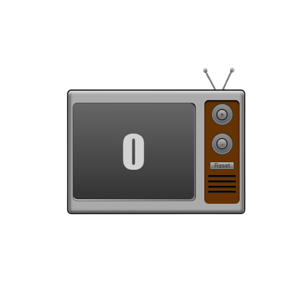

<!-- PROJECT LOGO -->
 

  

<h3 align="center">Javascript Counter</h3>

  

   A simple counter, you press a button and the numbers go up and down
      
    <a href="https://jsvintagetvcounter.netlify.app"  target="_blank"><strong>Explore the demo »</strong></a>
     
     
    ·
    <a href="https://github.com/Dannlgn/Javascript-Counter/issues">Report Bug</a>
    ·
    <a href="https://github.com/Dannlgn/Javascript-Counter/issues">Request Feature</a>
  

<!-- TABLE OF CONTENTS -->

  
Table of Contents

  <ol>
    <li>
      <a href="#about-the-project">About The Project</a>
      <ul>
        <li><a href="#built-with">Built With</a></li>
      </ul>
    </li>
    <li><a href="#contact">Contact</a></li>
  </ol>

<!-- ABOUT THE PROJECT -->

## About The Project

As a simple counter, just press the plus button to increase the number and the minus button to decrease it. You can even press Reset to return to 0!

(<a href="#readme-top">back to top</a>)

### Built With

- HTML
- CSS
- Javascript

(<a href="#readme-top">back to top</a>)

<!-- CONTACT -->

## Contact

Daniele Laganà  

- [@linkedin_profile](https://www.linkedin.com/in/daniele-laganà/)
- e-mail: daniele.lgn96@yahoo.it

Project Link: [Simple Javascript Counter](https://github.com/Dannlgn/Javascript-Counter)

(<a href="#readme-top">back to top</a>)

